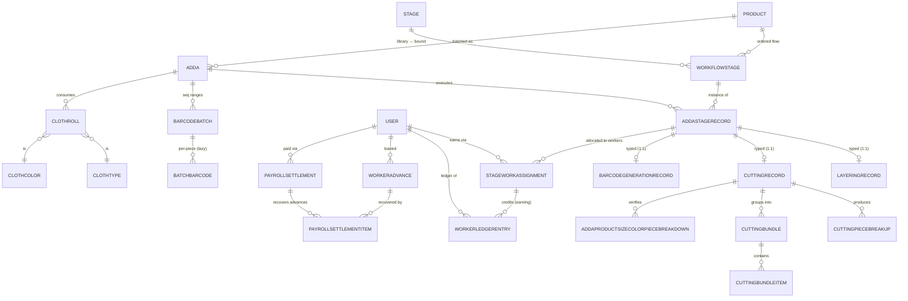

# GLOSSARY — Kapil Enterprises Inventory

One-line definitions of the domain terms used across this codebase. This is a
garment-manufacturing business, so many terms are Hindi/Hinglish factory words.
**Read this first if you're new** — the model names won't make sense without it.

> Convention note: code comments are intentionally written in Hinglish (Hindi in
> Latin script) with short "why" notes. That's a deliberate house style, not a bug.

---

## Production / manufacturing terms

| Term | Means | Model / where |
|---|---|---|
| **Adda** | One **production batch** — a single run of a product (e.g. `T-SHIRT-001`). Moves through the workflow stages start→finish. | `production.Adda` |
| **Product** | A factory product *definition* (T-SHIRT, NIKKAR). This is the **manufacturing** master, NOT a sellable catalog item. | `production.Product` |
| **Stage** (library) | A reusable, admin-managed step definition (Layering, Cutting…). Holds access rules (skills/roles) + a default cost rate. | `production.Stage` |
| **WorkflowStage** | A Stage **attached to one Product** with an order position + binding cost rate. The per-product production flow = its ordered WorkflowStages. | `production.WorkflowStage` |
| **AddaStageRecord** | The execution row for "this Adda × this WorkflowStage" — one per stage an Adda passes through. Holds the **frozen manufacturing cost** snapshot. | `production.AddaStageRecord` |
| **Layering** | First stage: laying cloth rolls in stacked **layers** on the cutting table. | `LayeringRecord`, `LayeringRollEntry` |
| **Cutting Pattern** | Stage where the cutting master records the pattern (video/photos) drawn on the layered cloth, + per-size proportions. | `CuttingPatternRecord` |
| **Cutting** | Stage that actually cuts the pieces; produces the piece **breakup** + **bundles**. | `production.CuttingRecord` |
| **Pattern** (ProductPattern) | A reusable cut-piece shape (Front, Back, Sleeve, Collar). A product needs N of each. | `production.ProductPattern` |
| **Breakup** (CuttingPieceBreakup) | Per-`(size, color, pattern)` **piece counts** produced by cutting. | `production.CuttingPieceBreakup` |
| **Bundle** (CuttingBundle) | A size-grouped container of cut pieces. Its **items** are `(pattern, color, count)` lines. | `CuttingBundle`, `CuttingBundleItem` |
| **Breakdown** (…PieceBreakdown) | The FINAL verified per-`(size, color)` piece count snapshot — the input that barcode generation + future stages consume. | `AddaProductSizeColorPieceBreakdown` |
| **Barcode Generation** | Stage that turns the verified breakdown into barcode **ranges**. | `BarcodeGenerationRecord` |
| **BarcodeBatch** | A contiguous sequence **range** for one `(Adda, color, size)` — e.g. seq 1..60. NOT one row per piece (storage win). | `tracking.BarcodeBatch` |
| **BatchBarcode** | Per-**piece** scan state (`pending→packed→dispatched`). Lazily created on first scan — untouched pieces have no row. | `tracking.BatchBarcode` |
| **Leftover** | Cloth left on a roll after layering — tracked for reuse, not waste. | `RemainingClothOfClothRoll` |
| **ClothRoll** | A physical roll of cloth (`CR-000142`). | `raw_materials.ClothRoll` |
| **StorageLocation** | Where rolls (and future finished goods) are physically kept. | `raw_materials.StorageLocation` |

## People / access terms (three separate concepts — don't conflate)

| Term | Means | Model |
|---|---|---|
| **Worker** (was *karigar*) | An employee doing production work. Renamed from "karigar" 2026-06-02. | RBAC role `worker` |
| **Role** | The **RBAC source of truth** for module/sidebar/URL access. Roles: `super_admin`, `manager`, `worker`, `listing_team`, `accountant`. | `inventory.Role` |
| **Skill** | What production *work* a user can do (`cutting_master`, …). Gates **stage** access — NOT module access. | `accounts.Skill` |
| **UserType** | Display/classification label only (e.g. "Supplier"). **Never** gates access. | `accounts.UserType` |

## Payroll / money terms (expense app)

| Term | Means | Model |
|---|---|---|
| **Allocation** | A worker's assigned slice of a stage's work. `earning = allocated_quantity × rate_snapshot`, frozen at allocation time. | `expense.StageWorkAssignment` |
| **Earning** | A **credit** in the ledger — money the factory owes the worker for allocated work. | `WorkerLedgerEntry` (credit) |
| **Advance** | Cash given to a worker *before* earnings — a **separate loan pool**. Does NOT touch the payable ledger; recovered at settlement. | `expense.WorkerAdvance` |
| **Payable / Balance** | What's owed a worker **right now** = `SUM(credits) − SUM(debits)`. Always computed live, **never stored**. | derived in `ledger_service.worker_balance` |
| **Settlement** | A payout event (any time the owner decides). Clears some/all payable + recovers some/all advances. | `expense.PayrollSettlement` |
| **Stage costing** | The **manufacturing** cost of running a stage (product profitability) — distinct from worker pay. Frozen at stage completion. | `AddaStageRecord.processing_cost` |

---

## How the core models relate (ER diagram)

Production lifecycle + the payroll ledger chain. (Renders on GitHub.)

*Read first for the big picture: [SYSTEM_DESIGN.md](SYSTEM_DESIGN.md). Deeper:
[docs/production/OVERVIEW.md](docs/production/OVERVIEW.md),
[docs/production/PAYROLL_ARCHITECTURE.md](docs/production/PAYROLL_ARCHITECTURE.md).*
