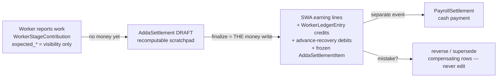

# Settlement — the moment money becomes real

> 📂 [Features](README.md) · [KOS home](../README.md) — *pehle yeh page, phir code.*

## Business Purpose

Factory mein worker roz kaam report karta hai ("maine 40 piece silai kiye").
Par **kaam report hona ≠ paisa ban jaana**. Malik pehle verify karta hai,
phir ek din baith kar poore Adda (production batch) ka hisaab karta hai:
*"is Adda par kis worker ka kitna bana?"* — **yehi event Settlement hai.**

Settlement answers three business questions at once:
1. Kitna banta hai? (earnings — per line: quantity × frozen rate)
2. Advance mein se kitna kaatna hai? (recovery — malik ki marzi, auto nahi)
3. Yeh sab PROVE kaun karega 6 mahine baad? (frozen snapshots + ledger)

**Settlement ≠ payment.** Settlement kehta hai "itna DENA BANTA hai";
cash dena ek alag event hai (`PayrollSettlement`, `/expense/workers/<id>/settle/`).
Isse business ko flexibility milti hai — hisaab aaj, cash agle hafte.

## Mental Model

Before reading any code, think like the senior who designed this:

> **Money is an event log, not a state.** Provisional numbers flow OUTWARD
> freely (visibility); committed money passes through ONE narrow, atomic,
> locked, audited gate. Everything after the gate is immutable — corrections
> are new events, never edits.

Hold that sentence and every design choice below (drafts carry no money,
frozen snapshots, reverse-don't-edit, lock order, derived balances) becomes
predictable instead of surprising. When you evaluate ANY change to this
feature, ask: *does it widen the gate, add a second gate, or let state
replace events?* If yes — wrong direction.

## Architecture



Three design pillars (all locked in [ADR-0005](../../docs/adr/0005-production-truth-vs-financial-truth-option-b.md)):
- **Option B:** production truth (kaam hua) aur financial truth (paisa banta hai)
  alag systems hain. Worker ke report par ledger NAHI likha jaata — sirf
  `expected_rate`/`expected_earning` freeze hote hain, dikhaane ke liye.
- **Adda-centric:** settlement poore Adda ka event hai, per-worker nahi —
  kyunki malik ka mental model batch-wise hisaab hai.
- **Append-only corrections:** finalized settlement kabhi EDIT nahi hota.
  Galti = `reverse` (ulti entries) ya `reverse & supersede` (ulti entries +
  naya settlement, `supersedes` FK chain ke saath).

## Engineering Thinking

*Why this design? What did a senior reject, and why?*

| Alternative | Why rejected |
|---|---|
| Credit ledger the moment work is reported | Provisional numbers become permanent money; every production correction becomes a money correction. This was the pre-V2 behavior — the cutover is [ADR-0007](../../docs/adr/0007-allocation-era-ledger-cutover.md), with `LEDGER_CREDIT_AT_ALLOCATION` kept as a tested rollback lever. |
| Store worker balance as a column | Drift ka invitation. Balance = `SUM(credit) − SUM(debit)`, always computed live ([ledger_service.worker_balance](../../config/expense/services/ledger_service.py)). |
| Auto-FIFO advance recovery | Malik control kho deta hai. Recovery per-advance, owner-chosen, guarded ≤ remaining **under lock**. |
| Edit a wrong settlement | History jhooth ho jaati. Reverse/supersede chain keeps every version auditable. |
| Per-worker settlement events | Batch hisaab ka business model todta; partial needs met instead by `only_worker=` filter (F&F case, PDD §20) applied AFTER all guards. |

Senior reasoning to absorb: **push provisional data outward (visibility),
pull committed data through ONE narrow gate (finalize), and make the gate
atomic, locked, and audited.** Everything else in this feature is a
consequence of that one sentence.

## Request Flow

```
Manager clicks Finalize on /expense/settlements/ADST-0007/
  → expense/views.py: AddaSettlementDetailView.post   (action=finalize; parses
      variance + recoveries; permission gate)
  → adda_settlement_service.finalize_adda_settlement  (THE atomic money write)
      → ledger_service.log_credit / log_debit          (money rows)
      → tracking.services.log_adda(SETTLEMENT_FINALIZED)  (Adda-360 timeline)
  → redirect back with success banner
```

## Frontend

Management UI only, 3 screens (mobile-first per house rule):
- **Queue** `/expense/settlements/` — Addas ready vs waiting.
- **Detail** `/expense/settlements/<reference>/` — draft preview: per-worker
  lines, variance inputs, per-advance recovery inputs, finalize/discard;
  after finalize: frozen read-only view + reverse/supersede actions.
- Worker side effect: `/expense/my/` (My Earnings) ladder moves
  **Expected → Earned** at finalize (see [flow](../flows/worker-gets-paid.md)).

## Backend

Single writer service: [config/expense/services/adda_settlement_service.py](../../config/expense/services/adda_settlement_service.py)

| Function | Job |
|---|---|
| `create_draft` | Scratchpad banata hai — NO money, NO frozen rows; recomputable |
| `settlement_queue` / `preview_lines` | Read-only funnels; **same guards as finalize** (PA-11-2: preview == money-write surface) |
| `finalize_adda_settlement` | THE write — walkthrough below |
| `reverse_adda_settlement` | Compensating ledger rows + status REVERSED/SUPERSEDED |
| `discard_draft` | Draft delete (drafts carry no money, so delete is safe) |

`finalize` in five verified steps (function: `finalize_adda_settlement`):
1. **Locks, in fixed order** — advisory `pg_advisory_xact_lock(5374)` → the
   `AddaSettlement` row → its `AddaStageRecord`s → their
   `WorkerStageContribution` rows (`of=('self',)` — the settled quantity
   `verified_quantity` lives on WSC, so it must be frozen too; PA-11-3) →
   `WorkerProfile` per worker (sorted by id) → `WorkerAdvance` rows.
   *Order todna = deadlock; see [transactions concept](../concepts/django/transactions.md).*
2. **Funnel** — `_settleable_lines` drops already-credited lines (era-A + era-B
   guards, both directions = double-pay impossible) and monthly-basis workers
   (R4: they're salaried, not piece-rate).
3. **Validate recoveries BEFORE any money moves** — every recovery ≤ advance
   remaining, correct worker; aadha-likha settlement kabhi exist nahi karta.
4. **Write money per line** — one `StageWorkAssignment` earning line per
   contribution (quantity from `settlement_resolver`: verified ?? reported;
   rate through the grouped→0 guard), stamp `WSC.settlement_line` (provenance),
   `ledger_service.log_credit` per line, `log_debit` + `PayrollSettlementItem`
   per recovery, frozen `AddaSettlementItem` per worker.
5. **Close** — status→FINALIZED, totals frozen (write-once, never re-read as
   live truth), timeline event logged.

## Models

| Model | Role | Key facts |
|---|---|---|
| `AddaSettlement` | The event | `reference` ADST-0001 unique; status draft→finalized→(reversed\|superseded); `supersedes` self-FK chain; frozen totals |
| `AddaSettlementItem` | Per-worker frozen snapshot | Write-once at finalize |
| `StageWorkAssignment` | Earning line (era-B) | One per contribution line; `earning_rate_snapshot`, `earning_amount_snapshot`; `adda_settlement` FK = structural era marker |
| `WorkerLedgerEntry` | THE money book | Append-only, amount always positive, direction in `entry_type`; see Database below |
| `PayrollSettlementItem` | Recovery line | Links advance ↔ debit ledger entry |
| `WorkerAdvance` | Loan pool | Separate from earnings; recovery only at settlement, owner-chosen |

All money FKs are `on_delete=PROTECT` — a financial event can never vanish
with its parent.

## Database

- Ledger indexes (all on `expense_workerledgerentry`): `(worker, -created_at)`,
  `(worker, entry_type)` ← serves the balance aggregate, `(worker, category)`,
  `(worker, entry_date)`, `(entry_date)`.
- DB armor: `CHECK (amount > 0)` (`expense_ledgerentry_amount_positive`) and
  partial-unique `uniq_one_reversal_per_entry` — **ek entry sirf ek baar
  reverse ho sakti hai, race ke against DB-level guarantee.**
- Balance is never stored; the real SQL PostgreSQL runs is in
  [transactions §6](../concepts/django/transactions.md#6-how-this-project-uses-it).

## Services (boundaries)

`adda_settlement_service` is the SOLE writer of `AddaSettlement`/`Item` + era-B
SWA lines; `ledger_service` is the SOLE writer of `WorkerLedgerEntry`
(ADR-0002, CLAUDE.md rule 5). CI gates 4b/4c census these write-sites.
**Money-Write STOP rule:** naya money-write path in services ke bahar dikhe
⇒ STOP + report, kabhi silently fix nahi.

## Permissions

- All settlement URLs: management only — `_ensure_management` in the service
  (permission via `permission_service`, never raw `is_superuser`) + sidebar
  rule gating (menu hidden ⇒ URL blocked, `SidebarAccessMiddleware`).
- Pay-basis flip: super-admin only, joins advisory 5374 so it can't race finalize.
- Reconciliation override (S5): super-admin + mandatory audited
  `override_reason` (`SettlementReconciliationEvidence`).

## Related URLs

| URL | Purpose |
|---|---|
| `/expense/settlements/` | Queue (ready/waiting) |
| `/expense/settlements/start/<adda_pk>/` | Start draft |
| `/expense/settlements/<reference>/` | Preview → finalize → reverse |
| `/expense/workers/<pk>/settle/` | CASH payment (separate event!) |
| `/expense/my/` | Worker's own Expected→Earned→Paid view |

## Related APIs

No external/REST API — settlement is an internal service-function API
(keyword-only args, docstring contracts). See `concepts/api-design` (Phase 5).

## Debugging Guide

| Symptom | Start here |
|---|---|
| "Worker ka balance galat lag raha hai" | Never trust displayed totals — recompute: `ledger_service.worker_balance(worker)`; then list that worker's `WorkerLedgerEntry` rows; every credit must trace to an SWA, every debit to advance/settlement |
| "Finalize refuses: nothing to settle" | The funnel dropped everything — lines already credited (era guards), worker monthly-basis (R4), or stage not payable |
| "Finalize blocked: reconciliation" | S5 gate: `over_allocated > tolerance`; check `SettlementReconciliationEvidence`; super-admin override needs a reason |
| "Same line paid twice??" | Should be impossible (era-A+B guards + provenance stamp). If you EVER see it: STOP, check `WSC.settlement_line`, ADR-0007, and raise — this is the alarm-bell class |
| "Deadlock on finalize" | Some code took worker/advance locks before 5374 — every settlement op MUST take the advisory lock first |

## Change Impact

*Modify this feature? Review these FIRST:*

- **Models**: `AddaSettlement*`, `StageWorkAssignment`, `WorkerLedgerEntry`, `PayrollSettlementItem` (+ their PROTECT chains)
- **The funnel**: `_settleable_lines` — every guard (era-A/B, monthly, grouped→0) runs here for preview AND finalize; touching one surface only = split-brain
- **Lock order** — any new lock must slot into the documented order; joining ops must take 5374 first
- **Reports/consumers**: payroll overview, worker detail, My Earnings ladder, Adda-360 timeline, reconciliation (S1/S5), rerate window (M1: per (stage_record, role) until settlement)
- **Tests**: `config/expense/tests/test_adda_settlement_service.py`, `test_v2_3_guards.py`, `test_reopen_voids_pay.py`, `test_s5_recon_block.py`, `test_r4_monthly_basis.py`, `test_r7_fnf.py` + goldens (₹344.25 / ₹801 / ₹633 byte-identical)
- **Concepts**: [transactions](../concepts/django/transactions.md), single-writer, append-only (Phase 3)

## AI Implementation Pitfalls

- ❌ **Writing `WorkerLedgerEntry` directly** (in code OR tests) — only
  `ledger_service` writes it; tests build money via services, never raw rows.
- ❌ **Crediting money at report/allocation time** — that's the pre-V2 world;
  ADR-0005 forbids it. `expected_*` fields are VISIBILITY, not money.
- ❌ **Editing a finalized settlement or its frozen totals** — corrections are
  reverse/supersede rows, always.
- ❌ **Adding a lock without joining the order** (5374 first) — instant
  production deadlock risk.
- ❌ **Reading frozen totals as live truth** — balances recompute from ledger
  (§11.9.4).
- ❌ **Summing `processing_cost` + settled labor** — double count (ADR-0009).
- ✅ Always verify: after any settlement change, the four-way identity
  (ledger ≡ settlement totals ≡ Σ items ≡ Σ snapshots) and the goldens still
  pass byte-identical.

## Implementation References

- ADR: [0005 Option B](../../docs/adr/0005-production-truth-vs-financial-truth-option-b.md) · [0007 era cutover](../../docs/adr/0007-allocation-era-ledger-cutover.md) · [0002 single-writer](../../docs/adr/0002-single-writer-per-ledger-and-history-table.md) · [0009 cost-truth](../../docs/adr/0009-cost-truth.md)
- Spec: [docs/ARCHITECTURE_V2.md](../../docs/ARCHITECTURE_V2.md) §11 (🔒 locked)
- Deep dive: [chokepoint doc](../../docs/LEARNING_2_0/CHOKEPOINTS/adda_settlement_service.md) (verified execution trace) · [journey](../../docs/LEARNING_2_0/REQUEST_JOURNEYS/settlement_finalize.md)

## Code References
- `config/expense/services/adda_settlement_service.py` (`finalize_adda_settlement`), `ledger_service.py`, `settlement_resolver.py`, `config/expense/models.py`
- Tests: `config/expense/tests/` (see Change Impact list)

## Learning Notes

Concepts this feature demonstrates (your lab specimens):
[transactions & locks](../concepts/django/transactions.md) · single-writer
discipline · append-only ledger · frozen snapshots · service-layer API ·
feature-flag rollback lever (`LEDGER_CREDIT_AT_ALLOCATION`) — Phase 3 pages.

## Interview Notes

*Interview Signal: 🟠 Senior — the full concurrency + correctness package.*
**Q1. "Design a payroll / wallet system."**
- *Short answer:* Event-log money — append-only ledger, derived balances,
  one explicit money boundary, corrections as new events.
- *Senior answer:* Separate the obligation event from the cash event; freeze
  rate/quantity snapshots at the boundary; make the boundary atomic + locked
  in a documented order; back every app-level guard with a DB constraint;
  pin the math with end-to-end golden tests.
- *Project example:* This exact feature — `AddaSettlement` finalize writes
  SWA lines + ledger credits + frozen items in one transaction; cash is a
  separate `PayrollSettlement`; goldens ₹344.25/₹801/₹633 byte-identical.
- *Follow-ups to expect:* "What if the ledger grows huge?" (registered
  snapshot-table seam) · "How do refunds work?" (reversal rows) · "Multi-currency?"

**Q2. "How do you prevent double payment under concurrency?"**
- *Short answer:* Locks + idempotency markers + DB constraints — defense in depth.
- *Senior answer:* One global gate (advisory lock) serializes the money
  operation; row locks in a FIXED order stop deadlocks; a provenance stamp
  makes retries visibly idempotent; a DB partial-unique constraint is the
  last wall if all code fails.
- *Project example:* 5374 advisory lock → row locks (settlement→SR→WSC
  `of=('self',)`→profiles→advances) → `WSC.settlement_line` stamp →
  `uniq_one_reversal_per_entry`.
- *Follow-ups:* "Why advisory not row lock?" (system-wide gate spans tables) ·
  "Why lock WSC when SR is locked?" (settled qty lives on WSC — PA-11-3).

**Q3. "Settlement vs payment — why two events?"**
- *Short answer:* Obligation ≠ cash.
- *Senior answer:* Coupling them forces money decisions at the wrong time,
  tangles corrections with cash history, and kills business flexibility
  (settle today, pay next week). Accounting identity stays clean when each
  ledger row has one meaning.
- *Project example:* `stage_earning` credit at finalize; `settlement_payment`
  debit at `/workers/<id>/settle/` — different days, both trace to ADST refs.
- *Follow-ups:* "How does the worker see the difference?" (Expected→Earned→Paid).

**Q4. "How would you audit this system?"**
- *Short answer:* Recompute everything from the ledger.
- *Senior answer:* Snapshots are claims; the append-only ledger is proof.
  Reconciliation identities (ledger ≡ boundary totals ≡ Σ items ≡ Σ snapshots)
  run in tests AND live; any figure must re-derive from raw rows months later.
- *Project example:* Four-way identity byte-exact at certification; 10/10
  negative probes refused; 88 live DB constraints.
- *Follow-ups:* "What if an identity breaks in production?" (it's a REAL bug —
  check identity first, then recent writers).

## Mock Interview Walkthrough

*How a real conversation flows across this page — practice answering out loud.*

**Interviewer:** "You mention a payroll system on your resume. Design decision you're proudest of?"
**You:** Separating settlement from payment. Settlement books the obligation — earnings plus owner-chosen advance recovery — in one atomic event; cash is a separate later event. It kept our accounting identities clean and gave the owner real flexibility. *(→ Business Purpose)*

**Interviewer:** "What stops two managers finalizing the same settlement simultaneously?"
**You:** Four layers. A global advisory lock serializes all settlement operations; row locks in a fixed documented order freeze what we bill; a provenance stamp on every paid line makes retries visibly idempotent; and a DB partial-unique is the last wall. Defense in depth — any one can fail. *(→ Engineering Thinking, locks)*

**Interviewer:** "Why the fixed lock order?"
**You:** Deadlock-freedom by construction — all transactions acquire in the same sequence, so a circular wait can't form. We even lock worker rows sorted by id. *(→ transactions §DSA)*

**Interviewer:** "A finalized settlement turns out wrong. Now what?"
**You:** Never edit — reverse. Compensating ledger rows dated to the original period, earning lines voided, optionally a superseding settlement whose FK points at the old one. The wrong version stays readable forever; that's the audit surviving the correction. *(→ settlement-lifecycle)*

**Interviewer:** "How do you know a refactor didn't shift anyone's pay?"
**You:** Golden journeys — real scenarios replayed end-to-end asserting byte-identical amounts, ₹344.25 exactly, not approximately. A one-paisa drift fails CI with the amount in the diff. *(→ testing-strategy)*

**Interviewer:** "What would you change at 100× volume?"
**You:** The boundaries hold; the registered seam is a closing-balance snapshot table for O(1) reads — deliberately deferred until numbers demand it. *(→ Evolution)*

## 🧠 Remember This

Settlement woh EK darwaza hai jahan se paisa system mein ghusta hai. Darwaze
se pehle sab kuch "expected" hai (dikhava, commitment nahi). Darwaza atomic
hai, locked hai, audited hai. Darwaze ke baad kuch bhi EDIT nahi hota —
galti ka ilaaj ulti entry hai. Balance kabhi store nahi hota — hamesha ledger
se ginte hain. **Ek gate, ek writer, zero edit.**

## 30-Second Revision

- Settlement = earnings + recovery DECISION event; cash = separate `PayrollSettlement`
- Option B: report par NO money — sirf `expected_*` freeze (ADR-0005)
- Finalize = atomic; locks: **5374 → ADST → SR → WSC(of=self) → profiles → advances**
- qty = verified ?? reported; rate = frozen snapshot through grouped→0 guard
- Double-pay walls: era guards → provenance stamp → reversal partial-unique
- Corrections: reverse / reverse+supersede — NEVER edit; frozen totals never re-read as truth
- Balance = `SUM(credit) − SUM(debit)`, live, indexed `(worker, entry_type)`
- Goldens: ₹344.25 · ₹801 · ₹633 byte-identical = the alarm system

## Evolution / Future Design

- **S6 (soak-gated):** `reported_quantity` column retirement — the dual-write
  rename-not-drop pattern completing.
- **Era-A deletion** (soak-gated): the rollback lever dies once production soaks.
- **Multi-factory (ADR-0010):** settlement stays per-Adda; identity model
  extends, the money boundary doesn't move.
- If volume grows 100×: ledger stays append-only; the registered seam is a
  closing-balance snapshot table (deliberately DEFERRED — see
  `worker_balance` comment in code).

## Related Concepts

[concepts/django/transactions.md](../concepts/django/transactions.md) ·
flow: [worker-gets-paid](../flows/worker-gets-paid.md) ·
(Phase 3): single-writer · append-only-tables · pg/locks · pg/constraints
