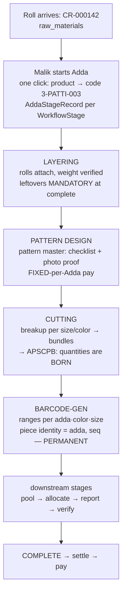

# Flow: Cloth to Garment — one Adda's whole life

> 📂 [Flows](README.md) · [LOS home](../README.md) — *kahani yaad rakho, files nahi.*

**Cast:** Malik (owner) · Rakesh (manager) · the cutting crew ·
one Adda: **3-PATTI-003** (a batch of one product).

> 💡 **Samjho aise:** "Adda" ka matlab hai **ek batch** — ek product ka ek lot
> jo poori factory se hokar guzarta hai. Socho ek **thaan (roll) se lekar packed
> kapde** tak ka safar.
>
> Safar ke do hisse hain, aur farq samajhna zaroori hai:
> - **Pehla hissa (cutting tak):** yahan tak sirf **kapda** hai — meters aur kilo.
>   Ginti nahi hoti, tukde nahi hote.
> - **Cutting ke baad:** ab **piece** ban gaye — ginti shuru. Yahin se har agla
>   stage in-hi pieces pe kaam karta hai, aur yahin se paisa ka hisaab bhi
>   piece pe chalta hai.
>
> Isiliye **Cutting is the mint** — wahi jagah hai jahan kapda "ginne laayak,
> paise laayak" cheez banta hai. Cutting ki ginti galat, to aage sab galat.

**One rule that explains most of the gates:** a stage cannot start until the
stage before it is genuinely finished, because each stage *consumes what the
previous one produced*. That is why the system refuses so often — it is not
being difficult, it is refusing to invent pieces that do not exist.

## The journey, step by step

**0. Cloth exists first** — `ClothRoll` (CR-000142) in raw_materials:
supplier, weight, cost/kg (financial-role-gated), storage location.

**1. Malik starts the Adda** — picks the product; the system creates one
`AddaStageRecord` per `WorkflowStage` of that product's owner-configured
flow (order, rate, pay-eligibility — the flow editor's output). The Adda's
code is born: 3-PATTI-003.

**2. Layering** — rolls physically attach to the Adda; weights verified.
**Leftovers are mandatory at complete** — remaining cloth is tracked wealth
(`RemainingClothOfClothRoll`), not waste. Production-INPUT stage:
non-payable since the stage-trio spec.

**3. Pattern Design** — the pattern master walks a CHECKLIST of Production
Components (Body, Panel, Sleeve…) with photo/video evidence. Pay is
FIXED-per-Adda — and [stage-tracking](../features/stage-tracking.md)'s
fixed-pay guard means a second "done" report is refused by name.

**4. Cutting — quantities are born.** Streams (lay→pattern→cut cycles) run;
piece breakups per (size, color, pattern) are recorded, bundled, and
verified into **APSCPB** — the single count every later number trusts
([cutting](../features/cutting.md)). A recut or split lay = a NEW stream
with a mandatory declared reason.

**5. Barcode Generation** — the verified breakdown becomes `BarcodeBatch`
ranges per (adda, color, size). **Piece identity = (adda, seq); printed
payloads are PERMANENT** (ADR-0010 §3) — a printed barcode is a promise the
schema keeps forever. Per-piece scan rows (`BatchBarcode`) are lazily
created on first scan — untouched pieces cost no storage.

**6. Downstream stages** — each completed stage freezes its pool
(verified-else-good); managers allocate slices; workers report through the
one door; managers verify ([allocation](../features/allocation.md),
[stage-tracking](../features/stage-tracking.md)).

**7. Complete → settle → pay** — the Adda finishes production; the money
story takes over ([worker-gets-paid](worker-gets-paid.md)).

## What can block each step (by design)

| Step | Blocker | Why it exists |
|---|---|---|
| Layering complete | leftovers not recorded | cloth accountability |
| Stage complete | workers mid-work (C3: IN_PROGRESS blocks; super-admin override = audited reason) | never strand a worker's open report |
| Cutting → downstream | stream JOIN: every blocking lane must finish cutting | no partial-count hand-offs |
| Any stage reopen | downstream allocations/reports exist → refused, names furthest blocker | reverse-first peel; pool chain never dangles |
| Stage reopen | settlement-credited → refused, names ADST | money armor ([two-truths](../concepts/architecture/two-truths.md)) |

## Interview corner

*Interview Signal: 🟠 Senior — multi-stage pipeline design.*

**Q. "Design a system to track a multi-stage manufacturing pipeline."**
- *Short answer:* Model the batch (Adda) as the unit moving through owner-configured stages; one execution record per batch×stage; quantities born at ONE verified point (cutting) become the single source every later stage consumes; block-and-refuse rules at every hand-off.
- *Senior answer:* The design questions are the hand-offs, not the stages: where is quantity truth born (put your verification THERE), what may block a stage transition (mid-work workers, unfinished parallel lanes, already-settled money), and what identity survives the whole pipeline (piece = (adda, seq), printed = permanent). Exceptional flows — recuts, split lays — become first-class declared acts with reasons-as-data, never silent edits.
- *Project example:* this page's diagram + blocker table; streams with the JOIN barrier; APSCPB as the mint's output; reopen armor naming its furthest blocker.
- *Follow-ups:* "Partial rework of two sizes?" (new stream, reason=recut, JOIN holds the rest) · "How does pay attach?" ([worker-gets-paid](worker-gets-paid.md) — deliberately a separate truth).

## Where this flow is pinned

Golden journeys replay real product configs end-to-end: ₹801 · ₹344.25 ·
₹633 settled journeys (FACTORY_OPERATIONS_MASTER = the operational truth of
16 ops). Dev testing law: DEV-marked Addas, freely created, never a hidden
dependency.

> 🧠 **Remember This:** Adda = ek batch ka poora safar. **Cutting se pehle kapda,
> cutting ke baad piece** — aur cutting hi wo jagah hai jahan ginti paida hoti
> hai (isliye "the mint"). Har stage agle ko pieces "deta" hai, isliye system
> aage badhne se **mana** karta hai jab tak pichhla stage sach mein poora na ho.
> Jab koi stage start hi na ho, sabse pehle pichhla stage dekho — 90% baar
> jawaab wahin milta hai.

## Implementation References

- Lifecycle canon: [docs/PROJECT_KNOWLEDGE_MAP.md](../../docs/PROJECT_KNOWLEDGE_MAP.md) §5 · ops truth: [docs/FACTORY_OPERATIONS_MASTER.md](../../docs/FACTORY_OPERATIONS_MASTER.md)
- Feature depth: [cutting](../features/cutting.md) · [allocation](../features/allocation.md) · [stage-tracking](../features/stage-tracking.md)
- Identity law: [ADR-0010](../../docs/adr/0010-growth-and-identity-policy.md) §3 (permanent barcode payloads)

