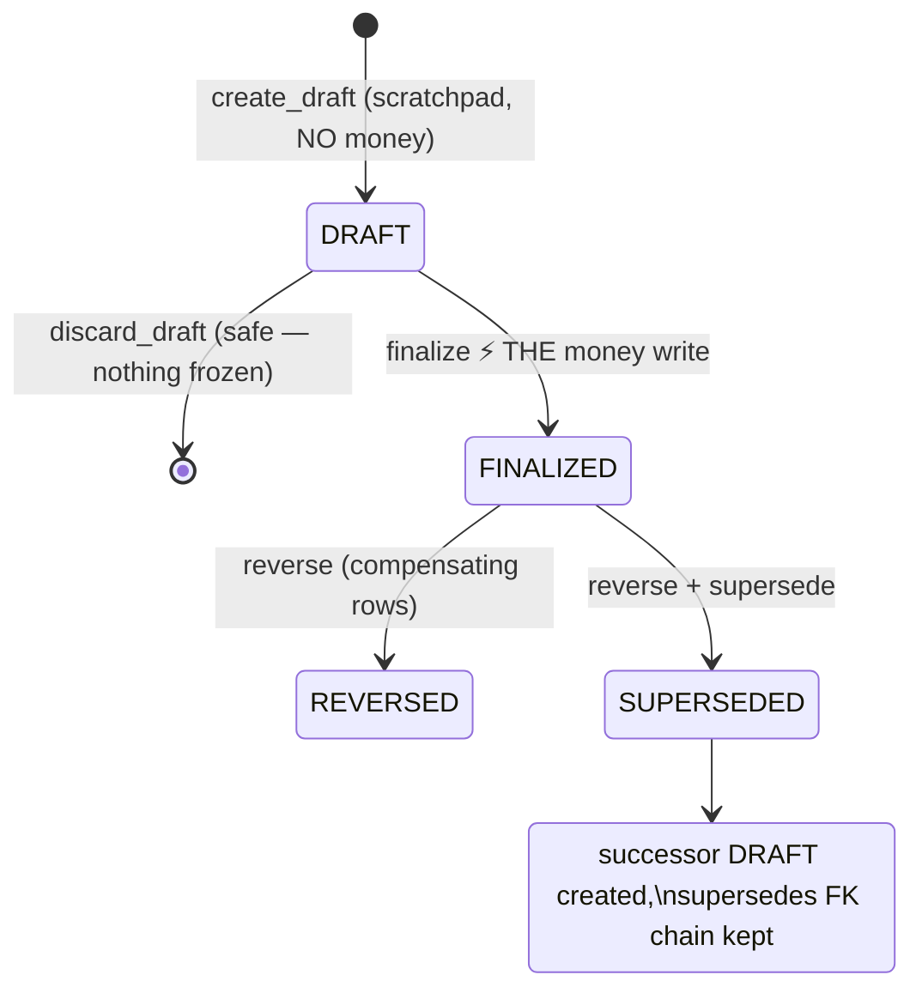

# Flow: The Settlement Lifecycle — states, transitions, corrections

> 📂 [Flows](README.md) · [LOS home](../README.md) — *kahani yaad rakho, files nahi.*

[worker-gets-paid](worker-gets-paid.md) tells the story from Meena's side.
This flow tells it from the EVENT's side: every state ADST-0007 can be in,
and what each arrow costs.

> 💡 **Samjho aise:** Settlement ko ek **bill** samjho jo malik banata hai.
>
> - **DRAFT** = bill abhi pencil se likha ja raha hai. Jitni baar chaaho mitao,
>   badlo, phaad do — kuch nahi hota, kyunki abhi ye sirf kaagaz hai.
> - **FINALIZED** = bill pe **pen se dastakhat** ho gaye. Ab ye kaagaz nahi,
>   **paisa** hai. Ledger mein entry chali gayi.
> - Dastakhat ke baad galti mili? Bill ko **mitaya nahi jaata**. Ek **ulta bill**
>   (reverse) banta hai jo pehle wale ko kaat deta hai — dono kaagaz record mein
>   rehte hain, hamesha.
>
> Isiliye system draft mein bahut aazadi deta hai aur finalize pe bahut sakhti.
> **Sasti jagah pe aazadi, mehngi jagah pe pehra.**

**The one line to carry away:** everything before the signature is editable,
everything after it is *append-only*. An accountant should be able to look at
this Adda in two years and see not just the final number but every correction
that produced it, and who made each one.

## The transitions, precisely

**→ DRAFT** (`create_draft`): a recomputable preview — per-worker lines
from the funnel, variance inputs, recovery planning. Zero money, zero
frozen rows; the queue (`settlement_queue`) shows which Addas are ready vs
waiting. **PA-11-2 law: preview surfaces run the SAME guards as finalize**
(grouped→0 rate guard at `settlement_queue` + `_line_dict` too) — a preview
that lies about money is a money bug.

**DRAFT → gone** (`discard_draft`): drafts carry nothing, so deletion is
honest — the one place delete is legal in the money system.

**DRAFT → FINALIZED** (`finalize_adda_settlement`): the atomic gate —
locks in order (5374 → ADST → SRs → WSC → profiles → advances), funnel
guards (era-A/B already-credited, monthly-basis, grouped→0), recoveries
validated BEFORE any write, then per line: SWA + ledger CREDIT + provenance
stamp; per recovery: DEBIT + PSI; per worker: frozen `AddaSettlementItem`;
totals frozen write-once. Full anatomy: [settlement](../features/settlement.md).
Partial settlement is legal (§11.8): `only_worker=` (F&F) filters the
funnel OUTPUT — guards untouched; the mixed settled/unsettled state on one
stage record was verified safe (all consumers line-granular).

**FINALIZED → REVERSED** (`reverse_adda_settlement`): compensating ledger
rows (reversals carry the ORIGINAL entry dates — period-honest), SWA lines
voided, PSI recovery rows stamped `reversed_at` (advance remaining
restores). Nothing edited; the wrong settlement remains readable forever.

**FINALIZED → SUPERSEDED** (`reverse + supersede=True`): same compensation
PLUS a successor draft whose `supersedes` FK points at the corpse — the
chain of "what we believed, when" survives every correction cycle.

## The armor around FINALIZED (what refuses, and why)

| Attempt | Response |
|---|---|
| Edit a frozen total/item | No code path exists; totals are write-once, never re-read as truth (§11.9.4) |
| Correct a settled line's quantity | `set_verified_quantity` refuses, NAMES the ADST — reverse first |
| Reopen a settlement-credited stage | Refused, names the ADST (V2-3 armor) |
| Finalize twice | Second waits on locks, sees FINALIZED, refuses |
| Finalize with `over_allocated > tolerance` | S5 reconciliation BLOCK (flag-gated): refuses unless super-admin override with audited `override_reason` (`SettlementReconciliationEvidence`) |
| Rate correction post-settlement | `rerate_stage_role` window is UNTIL settlement, per (stage_record, role) — after that, reverse first |

## Why the shape is draft-heavy and finalize-thin

All thinking happens where mistakes are FREE (draft: recompute, discard,
adjust). The expensive transition is one atomic function with everything
validated up front — *aadha-likha settlement kabhi exist nahi karta.* This
is the general pattern for any irreversible operation: **make the cheap
zone rich and the expensive gate thin.**

> 🧠 **Remember This:** **DRAFT = pencil, FINALIZED = pen.** Pencil wale zone
> mein jitna chaaho theek karo — abhi paisa bana hi nahi. Pen ke baad kuch mitao
> mat; **ulti entry** (reverse) daalo. Agar kabhi aapko "settlement delete karne"
> ka mann kare — ruk jao, wahi galat raasta hai. Sahi jawaab hamesha *reverse*
> hai, kyunki paisa ka record kabhi jhooth nahi bol sakta.

## Implementation References

- The gate's anatomy: [features/settlement.md](../features/settlement.md) · person-side: [worker-gets-paid](worker-gets-paid.md)
- Spec: [docs/ARCHITECTURE_V2.md](../../docs/ARCHITECTURE_V2.md) §11 (states §11.3, partial §11.8, snapshots §11.9)

## Code References
- `adda_settlement_service.py` — all five verbs · S5 gate: [docs/S5_DESIGN_RECEIPT_2026_06_14.md](../../docs/S5_DESIGN_RECEIPT_2026_06_14.md)

