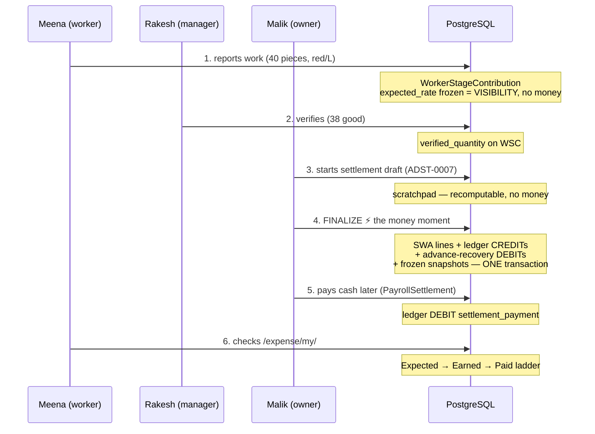

# Flow: Worker gets paid — piece se cash tak

> 📂 [Flows](README.md) · [LOS home](../README.md) — *kahani yaad rakho, files nahi.*

**Cast:** Meena (worker, stitching) · Rakesh (manager) · Malik (owner/super-admin)
· the system's three money states: **Expected → Earned → Paid**.

> 💡 **Samjho aise:** Meena ne 50 piece silai kiye. Ab teen alag-alag cheezein
> hain, aur inko gadbad karna hi sabse badi galti hoti hai:
>
> - **Expected** = *"itna banta hai"* — sirf hisaab, kaagaz pe. Paisa **nahi** bana.
> - **Earned** = *"malik ne khaata band kar diya"* (settlement) — ab ye paisa
>   pakka Meena ka hai, ledger mein likha gaya.
> - **Paid** = *"haath mein cash aa gaya"*.
>
> Beech ka step (**settlement**) hi wo darwaza hai jahan hisaab paisa banta hai.
> Us darwaze se pehle aap quantity jitni baar chaaho theek kar sakte ho — kuch
> nahi bigdega. Darwaza band hone ke baad galti sudhaarne ka tareeka alag hai:
> purani entry **mitai nahi jaati**, ulti entry daali jaati hai (reverse).

**Why this matters more than it looks:** most "the money is wrong" panics come
from reading one of these three states and thinking it is another. Expected
changing is *normal*. Earned changing is *an event with a name and an author*.

## The journey, step by step

**1. Meena reports work** — stage screen par: "40 pieces, red, L".
System writes a `WorkerStageTask` + `WorkerStageContribution` (production
truth, the SOLE record that work happened). Us moment ka rate
`expected_rate` mein **freeze** hota hai aur `expected_earning` dikhta hai —
**par yeh sirf VISIBILITY hai. Ledger mein KUCH nahi likha jaata** (Option B,
[ADR-0005](../../docs/adr/0005-production-truth-vs-financial-truth-option-b.md)).
Meena ko dikhta hai: *Expected: ₹200*.

**2. Rakesh verifies** — checks the bundle, records `verified_quantity = 38`
(2 pieces alter mein gaye). Production truth corrected — aur kyunki paisa
abhi bana hi nahi, **koi money correction nahi karni padi**. Yehi Option B
ka payoff hai.

**3. Malik starts a settlement draft** — `/expense/settlements/start/<adda>/`
→ `create_draft` → reference **ADST-0007**. Draft = scratchpad: preview
lines, variance, recovery planning. Delete-able, recompute-able, **zero money**.

**4. FINALIZE — the money moment.** One click, one
[atomic transaction](../concepts/django/transactions.md), locks in fixed
order (advisory 5374 → settlement → stage records → contributions →
profiles → advances):

- Meena's line: quantity = **verified ?? reported** = 38 × rate ₹5 = ₹190
  → one `StageWorkAssignment` earning line + ledger **CREDIT ₹190**
  (`stage_earning`, traced to the SWA).
- Malik chose to recover ₹50 from her ₹500 advance → ledger **DEBIT ₹50**
  (`advance_recovery`, guarded ≤ remaining, under lock).
- Her frozen `AddaSettlementItem` snapshot written; settlement → FINALIZED.

Meena's ladder now: *Earned: ₹190 · recovered ₹50*. Balance =
`SUM(credits) − SUM(debits)` — computed live from the ledger, never stored.

**5. Cash, separately.** Days later Malik pays her at
`/expense/workers/<id>/settle/` → `PayrollSettlement` → ledger **DEBIT**
(`settlement_payment`). **Settlement ≠ payment** — obligation pehle bani
thi, cash ab gaya.

**6. Meena checks `/expense/my/`** — the Expected → Earned → Paid ladder,
har number ledger se derive hota hai. 6 mahine baad bhi har rupaya us
`ADST-0007` reference tak trace hota hai.

## What can go wrong (and what the system does)

| Moment | Failure | Defense |
|---|---|---|
| Step 1–2 | Wrong report/verify | Fix production truth freely — no money exists yet |
| Step 4 | Crash mid-finalize | [Atomic](../concepts/django/transactions.md): all-or-nothing, retry-safe |
| Step 4 | Two managers finalize together | Advisory lock 5374 + row locks — one waits, then sees FINALIZED, refuses |
| Step 4 | Verify-edit racing finalize | WSC rows locked `of=('self',)` — the edit blocks, then refuses (PA-11-3) |
| After 4 | Wrong rate discovered | `reverse` or `reverse & supersede` — compensating rows, history intact |
| Step 5 | Overpay attempt | Recovery/payment guards ≤ remaining, under lock |

## Where this flow is pinned

Golden journeys replay this exact story end-to-end through services and
assert **byte-identical** money: ₹344.25 (Lower) · ₹801 · ₹633 — plus
historical ₹225. Change anything in this flow and the goldens are the alarm.

> 🧠 **Remember This:** teen states yaad rakho — **Expected → Earned → Paid**.
> Settlement se **pehle** quantity theek karna free hai (paisa bana hi nahi).
> Settlement ke **baad** kuch bhi mitao mat — ulta entry daalo (reverse), taaki
> puraana record zinda rahe. Aur agar kabhi shak ho ki "paisa galat hai", pehle
> yeh poocho: *main kaunsa state dekh raha hoon?* Aadhe se zyada confusion wahin
> khatam ho jaata hai.

## Walk it yourself (dev)

1. Log in as dev manager → report + verify work on a dev Adda.
2. `/expense/settlements/` → start draft → watch preview lines match the
   funnel rules → finalize.
3. `env/bin/python config/manage.py shell -c "…worker_balance(worker)…"` —
   recompute and match the UI.

## Interview corner

*Interview Signal: 🟠 Senior — the system-design retell.*

**Q. "Tell me about a system you built — walk me through one core flow."**
- *Short answer:* Retell THIS page in 90 seconds: report (no money) → verify (free correction) → settle (atomic money birth, locked in order) → pay cash (separate event) → every number derived from an append-only ledger.
- *Senior answer:* Emphasize the three deliberate gaps: report≠money (Option B), settlement≠payment (obligation vs cash), and correction-before vs correction-after the boundary (free edit vs compensating reversal). Those gaps ARE the design.
- *Project example:* Meena's ₹190 story with the failure table — crash mid-finalize, double-finalize race, verify-vs-finalize race — each with its named defense.
- *Follow-ups:* "What was the hardest bug risk?" (the PA-11-3 lost-update — lock what you bill) · "How do you KNOW it still works?" (goldens byte-identical).

## Implementation References

- Feature page: [settlement](../features/settlement.md) (models, locks, guards)
- Concept: [django/transactions](../concepts/django/transactions.md)
- Deep dives: [DATA_FLOWS/stage_earnings_flow](../../docs/LEARNING_2_0/DATA_FLOWS/stage_earnings_flow.md) · [fnf_business_flow](../../docs/LEARNING_2_0/DATA_FLOWS/fnf_business_flow.md) · [REQUEST_JOURNEYS/settlement_finalize](../../docs/LEARNING_2_0/REQUEST_JOURNEYS/settlement_finalize.md)

## Code References
- `config/expense/services/adda_settlement_service.py` · `payroll_service.py` · `config/expense/views.py` (`MyEarningsView`)

